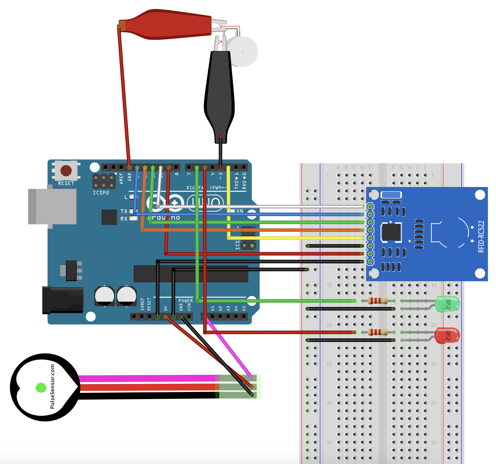
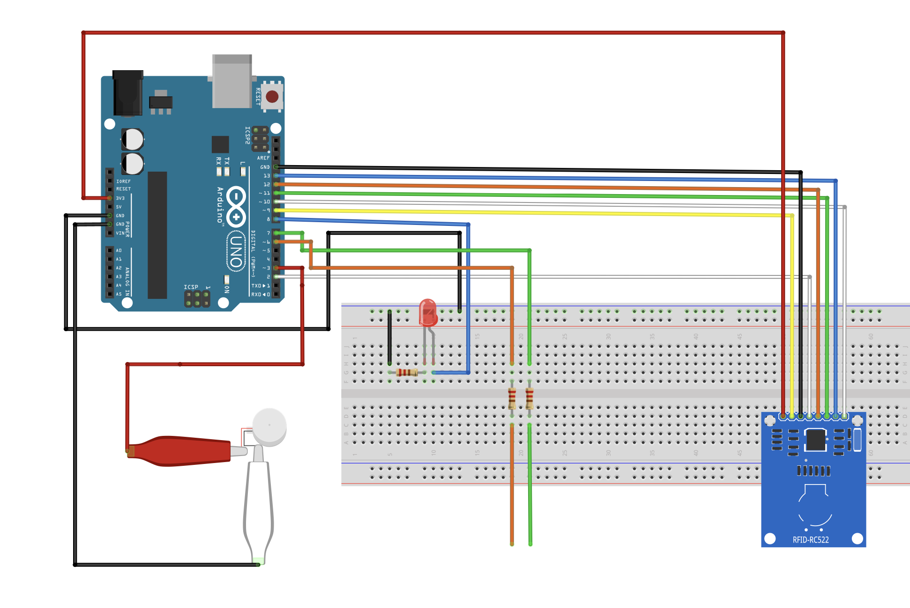

```
Lea Kettinger
Team 8 - Vitrack
IMD SS SS23, h_da
```

## Inbetriebnahme

[ArduinoIDE](https://www.arduino.cc/en/software) installieren


#### Vitalwertetracker

- 1x Arduino Uno R3
- 1 x RFID RC522 mit Reader & Chip 13,56MHz SPI
- 1x DC 3 V 80mA Mini Vibrationsmotoren 11000 RPM 1020 
- 1x ICQUANZX Pulsmesser Pulsmesser Modul
- 1x Arduino UNO und USB-Kabel A
- 1x Breadboard
- 2x Krokodilklemmen mit Kabel
- 2x Wiederstände
- 2x LED
- 19x Jumper-Wire

1. Arduino Uno R3 mit dem USB-Kabel an den PC anschließen
2. Die Messen_beschreiben.ino in der ArduinoIDE öffnen
3. Den Code über die ArduinoIDE auf den Arduino Uno R3 aufspielen
4. Die oben beschriebenen Komponenten wie im folgenden Fritzing gezeigt verbinden



Um den Pulsmesser zu simulieren, wird die eine Steckplatine verwendet. Diese repräsentiert den Writer. Auf dieser sind ebenfalls zwei LEDs, ein Vibrationsmotor angeschlossen sowie zwei 220 Ohm Widerstände. Um den Puls zu messen muss ein Finger an die Beschitete Seite des Pulsmessers gehalten werden, wurde der Puls erfolgreich gemessen vibriert der Vibrationsmotor kurz um so die Messung zu bestätigen. Um über die Messung ein direktes Feedback über die gemessenen Daten zu bekommen werden LEDs verwendet. Ist der gemessene Wert optimal leutet die Grüne LED auf, weicht der Wert dem Optimum ab leuchtet die rote LED auf. 

Dieser gemessene Wert wird auf den RFID Reader übertragen und kann dann mithilfe des RFID Chips an das Auslesegerät übetragen werden.

---

#### Auslesegrät

- 1x Arduino Uno R3
- 1x RFID RC522 mit Reader & Chip 13,56MHz SPI
- 1x LED
- 1x Arduino UNO und USB-Kabel A
- 1x Breadboard klein
- 1x Widerstand
- 10x Jumper-Wire

1. Arduino Uno R3 mit dem USB-Kabel an den PC anschließen
2. Die auslesen.ino in der ArduinoIDE öffnen
3. Den Code über die ArduinoIDE auf den Arduino Uno R3 aufspielen
4. Die oben beschriebenen Komponenten wie im folgenden Fritzing gezeigt verbinden



Der Schaltplan zeigt ein Breadboard, welches mit einem 
Microcontroller, in diesem Fall ein Arduino UNO, angeschlossen ist. 

Die Steckplatine repräsentiert den Reader. Hier ist eine LED mit einem 220 Ohm Widerstand in den Stromfluss integriert, diese soll leuchten, wenn ein Chip ausgelesen wird.

